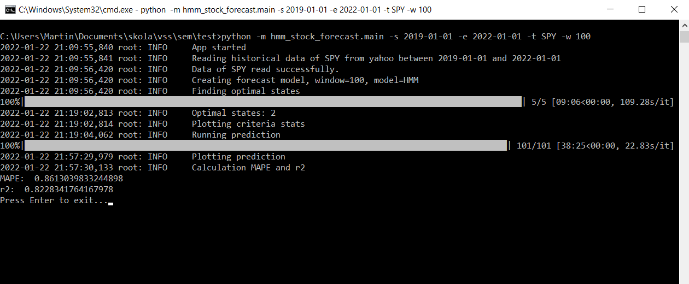
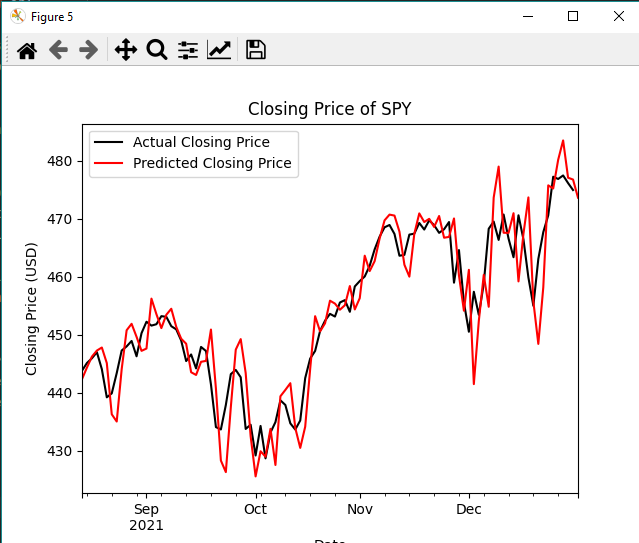

# HMM-Stock-Forecast
Stock forecasting based on (gaussian) Hidden Markov Model

## Model
Model implementation is based on these two articles:

- [1] Nguyen N. Hidden Markov Model for Stock Trading. International Journal
of Financial Studies. 2018; https://doi.org/10.3390/ijfs6020036.
- [2] M. R. Hassan and B. Nath, Stock market forecasting using hidden Markov
model: a new approach 5th International Conference on Intelligent
Systems Design and Applications (ISDA’05), 2005, pp. 192-196, doi:
10.1109/ISDA.2005.85.

## Arguments
Application accept these arguments:
- **-t** stock ticker (e.g. AAPL)
- **-f** path to csv soubor (4 columns: Open, Low, High, Close)
- **-s** data start date
- **-e** data end date
- **-w** window size (see [1] for more information about window)
- **-m** type of hmm implementation:
    - **HMM** - our implementation (default)
    - **pomegranate** - https://github.com/jmschrei/pomegranate
    
## Run
- In first step program find number of optimal hidden states (n) based on:
    - AIC (Akaike information criterion)
    - BIC (Bayesian information criterion)
    - HQC (Hannan-Quinn information criterion)
    - CAIC (Bozdogan Consisten Akaike information criterion)
    
- Then prediction is estimated for w (window) business days. Everytime historical data 0-x are used to predict closing price
at day x+1

## Results
- Ticker: SPY
- Start date: 2019-01-01
- End date: 2022-01-01
- Window size: 100

- MAPE: 0.861 %
- r2: 82 %

